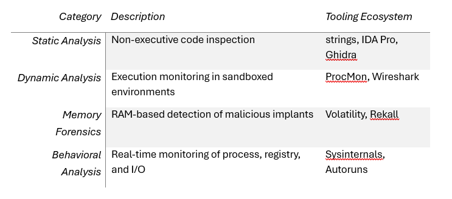

# Week 1 Report

# GitHub and Foundational Linux Command Utilization

## Overview

- GitHub stands as a pivotal infrastructure in modern cybersecurity and software development. Its distributed version control and advanced repository orchestration serve essential functions in code auditing, DevSecOps integration, infrastructure-as-Code management, and collaborative tooling. 
- Proficiency in Git is thus fundamental for Red Team operators and security engineers alike.
- Simultaneously, expertise in Linux command-line operations in indispensable. The terminal is the backbone of most offensive security tasks including reconnaissance, privilege escalation, persistence, and lateral movement.
- An adept understanding of Linux is a prerequisite for any professional working in adversarial simulation or threat emulation.

## Core Git Concepts Practiced

- `git init` -> Repository initialization
- git clone / git pull -> Source code retrieval and synchronization 
- git add / git commit – Staging and versioned tracking of code
- git push – Remote repository update
- git branch / merge – Modular feature development and integration
- git log / blame – Historical code forensics and author attribution

## Linux Command Taxonomy

- Filesystem:  `ls -al`, `cd`, `find`, `file`, `nano`
- System Diagnostics: `uname -a`, `df -h`, `uptime`, `top`, `whoami`
- Access Control: `chmod`, `chown`, `umask`
- Networking: `netstat`, `ss`, `ping`, `nmap`, `curl`, `wget`
- Process Management: `ps`, `kill`, `htop`, `tasklist`, `pkill`
- Scripting & Parsing: `bash`, `awk`, `sed`, `grep`, `for`, `if`

#### References:
- [GitHub Documentation](https://docs.github.com/en)
- [Linux Command Cheatsheet](https://phoenixnap.com/kb/linux-commands-cheat-sheet)

# Structured GitHub Repository Development

### Repository: Digisuraksha Internship Playbook

Directory Layout:
```
 Digisuraksha Internship Playbook/
|-- README.md
|-- Month 1
    |-- Week 1
        |-- Tasks
        |-- Practical
        |-- Reports
    |-- Week 2
        |-- Tasks
        |-- Practical
        |-- Reports
    |-- Week 3
        |-- Tasks
        |-- Practical
        |-- Reports
    |-- Week 4
        |-- Tasks
        |-- Practical
        |-- Reports
|-- Month 2
    |-- Week 5
        |-- Tasks
        |-- Practical
        |-- Reports
    |-- Week 6
        |-- Tasks
        |-- Practical
        |-- Reports
    |-- Week 7
        |-- Tasks
        |-- Practical
        |-- Reports
    |-- Week 8
        |-- Tasks
        |-- Practical
        |-- Reports
|-- Projects
    |-- Projects assigned during the internship
|-- LICENSE    

```
**Methodology:** Tree structures were generated using the tree utility, accompanied by Markdown documentation to ensure traceable and standardized reporting.

# Strategic Role Declaration – Red Team Commitment

Role Selection: Red Team 🔴

### Justification
- Deep-rooted expertise in offensive security paradigms, C2 framework deployment, and post-exploitation scripting
- Demonstrated operational experience via Hack The Box, TryHackMe, and independent bug bounty research
- Proficiency in adversarial simulation and real-world exploit engineering
- Tactical command over lateral movement, credential harvesting, and privilege escalation chains

### Objectives of Engagement
- Payload Weaponization
- Exploit Delivery and Execution
- Initial Compromise and Privilege Escalation
- Command and Control (C2) Infrastructure Management
- Data Exfiltration and Lateral Expansion

# Digital Forensics and OSINT Methodologies

## Digital Forensics Framework
- Digital forensics is central to post-incident investigations, evidentiary reporting, and attack surface reconstruction. The discipline incorporates volatile and non-volatile data acquisition, hash-based verification, temporal sequencing, and environment reconstruction.

### Key Techniques:

- Maintaining forensic integrity through chain of custody
- Disk imaging with hash verification (MD5, SHA-256)
- Timeline reconstruction from file system and registry artifacts
- Memory image parsing for active threat visibility

### Tools Employed:

- [Autopsy](https://www.sleuthkit.org/autopsy/)
- [Volatility](https://volatilityfoundation.org/)
- [FTK Imager](https://accessdata.com/product-download/ftk-imager-version-4-5)
- [NirSoft Suite](https://www.nirsoft.net/)

## OSINT Capabilities

- Open Source Intelligence (OSINT) represents the foundation of passive reconnaissance. It enables asset mapping, infrastructure profiling, threat actor analysis, and social engineering context development.

### Tools Utilized:

- [theHarvester](https://github.com/laramies/theHarvester)
- [Spiderfoot](https://github.com/smicallef/spiderfoot)
- [Shodan](https://www.shodan.io/)
- [Maltego](https://www.maltego.com/)
- [Recon-ng](https://github.com/lanmaster53/recon-ng)

### Use Cases:
- Threat actor fingerprinting
- Corporate surface enumeration
- Social engineering intelligence collection

# Advanced Malware Analysis and Threat Attribution

## Malware Analysis Taxonomy


## Key Indicators of Compromise (IoCs)
- Abnormal system calls: `VirtualAlloc`, `CreateRemoteThread`
- Registry-based persistence (`HKCU\...\Run`)
- Outbound connections on non-standard ports (C2 traffic)
- Fileless payloads utilizing PowerShell, WMI, or macros


## In-Depth Interpretation of the Malware Analysis Checklist

- The provided checklist constitutes a comprehensive 58-point analytical model for dissecting malware campaigns.

1. Host-Level Forensics
    - Registry audits to isolate persistence vectors
    - Prefetch and shortcut artifact analysis for execution timelines
    - File system review for self-replicating or embedded executables

2. Network Traffic Inspection
    - DNS tunneling detection through Wireshark
    - TCP handshake analysis for unauthorized connections
    - nslookup, WHOIS, and C2 domain pivoting

3. Binary and Metadata Inspection
    - Hash validation (MD5/SHA256) and signature verification
    - Hex-level entropy mapping via Hex Editor Neo
    - Packer/obfuscator detection through PEiD

4. Volatile Memory Analysis
    - Process listing (pslist) and injection detection (malfind)
    - Hidden process discovery (psxview)
    - In-memory C2 channel monitoring (netscan)

5. Browser and User Profile Analysis
    - Malicious extension identification
    - Cookie manipulation and session hijacking traces
    - Artifact recovery from download directories

6. Sandbox and Threat Intel Integration
    - VirusTotal scanning and result parsing
    - Detonation in Any.Run or Joe Sandbox
    - Consolidated IoC and campaign report generation

7. Attribution and APT Mapping
    - Language ID, debug path, and timestamp analysis
    - Feature-based clustering to known APT campaigns
    - Detection of recycled command structures and shared stubs

# iOS Forensics Snapshot

- Safari history (/Library/Safari/History.db)
- SMS messages (/Library/SMS/sms.db)
- Multimedia evidence (/Media/PhotoData/)
- System and app configurations (/Library/Preferences/*.plist)

# Reference Corpus:
- [Malware Analysis Video](youtu.be/ta8AJplqMjk?feature=shared)
- [Tazsk Labs](https://labs.taszk.io/articles/post/full_chain_bb_part1/)
- [Malwr4n6 Blog](https://www.malwr4n6.com/post/macos-malware-analysis-pkg-files)
- [Microsoft Sysinternals](https://learn.microsoft.com/en-us/sysinternals/)
- [Terabox Malware Samples](https://www.terabox.app/sharing/link?surl=6meoltiWK18hoz-6RgqWFQ)

# Core Learnings and Technical Enrichment
- Advanced Git fluency aligned with professional DevSecOps workflows
- Tactical Linux shell proficiency for offensive operations
- Differentiated Red Team engagement strategies vs. Blue Team response logic
- Practical experience in digital forensics and live data acquisition
- Sophisticated malware analysis using layered investigative techniques
- Enhanced documentation and reporting skills consistent with consulting deliverables
